# Architecture Diagrams: AI Mesh Network Platform

This document provides high-quality Mermaid diagrams visualizing the core architecture, flows, and protocols.

## System Architecture

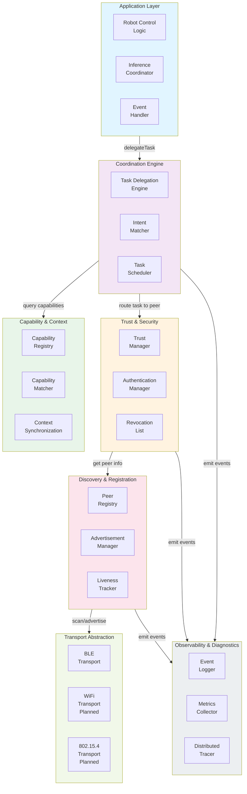

## Peer Discovery Flow

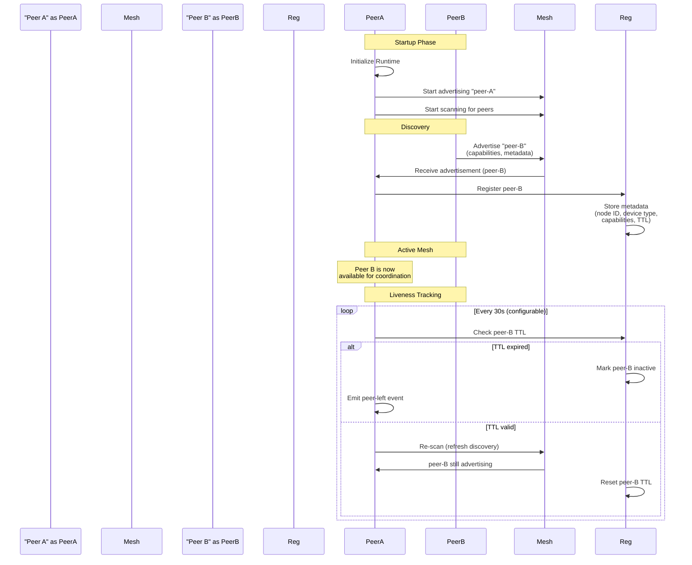

## Trust Handshake Protocol

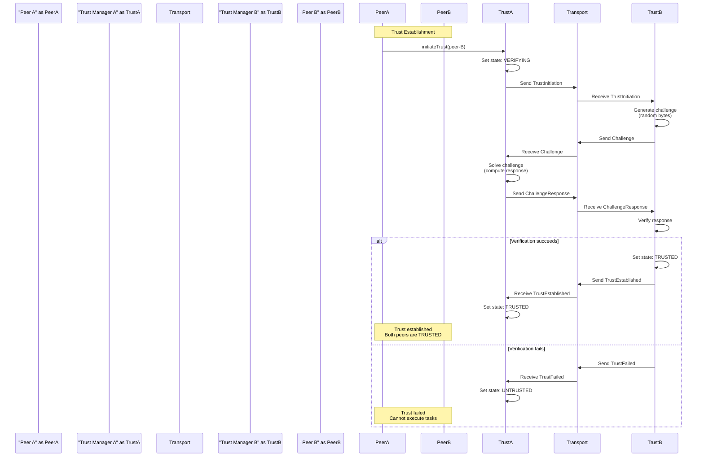

## Task Delegation Flow

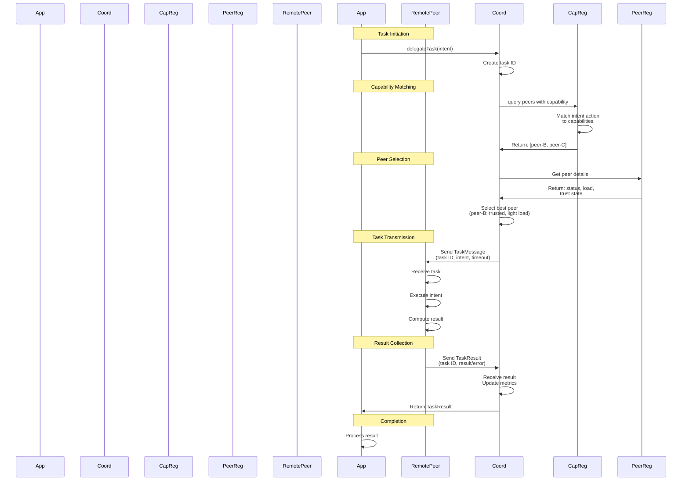

## Capability Negotiation Flow

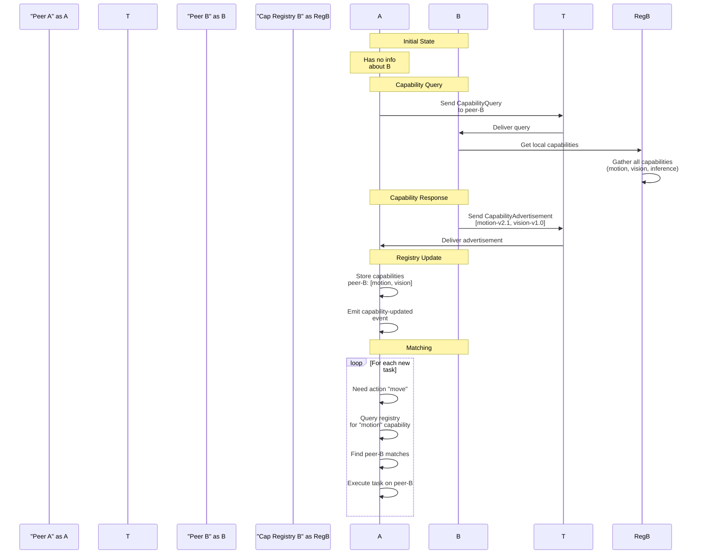

## Complete Task Execution Flow (End-to-End)

```mermaid
graph TD
    Start["App: delegateTask<br/>(action: 'process-image'<br/>params: {...})"] 
    
    Start --> CreateIntent["1. Create Intent<br/>action: 'process-image'<br/>requiredCapability: 'image-processor'"]
    
    CreateIntent --> QueryCap["2. Query Registry<br/>Which peers have<br/>'image-processor'?"]
    
    QueryCap --> GetPeers["3. Get Peer Details<br/>Peer A: v1.0, trusted, CPU 20%<br/>Peer B: v2.0, untrusted, CPU 80%"]
    
    GetPeers --> Select["4. Select Best Peer<br/>Choose Peer A<br/>(better version, trusted,<br/>lower load)"]
    
    Select --> SerializeIntent["5. Serialize Intent<br/>Binary format<br/>+ metadata"]
    
    SerializeIntent --> SendTask["6. Send Task Message<br/>via BLE<br/>include: task ID,<br/>timeout (30s)"]
    
    SendTask --> RemoteReceive["7. Remote Execution<br/>Peer A receives<br/>Deserializes intent<br/>Executes task"]
    
    RemoteReceive --> Compute["8. Computation<br/>Process image<br/>Generate result"]
    
    Compute --> SendResult["9. Send Result<br/>task ID, result data<br/>execution time"]
    
    SendResult --> ReceiveResult["10. Result Reception<br/>Coordination engine<br/>collects result"]
    
    ReceiveResult --> UpdateMetrics["11. Update Metrics<br/>task_latency: 245ms<br/>task_success: 1"]
    
    UpdateMetrics --> ReturnToApp["12. Return to App<br/>TaskResult object<br/>status, result, time"]
    
    ReturnToApp --> End["App processes<br/>result"]
    
    style Start fill:#e3f2fd
    style End fill:#c8e6c9
    style Select fill:#fff9c4
    style Compute fill:#ffe0b2
    style UpdateMetrics fill:#f0f4c3
```

## Context Synchronization Flow

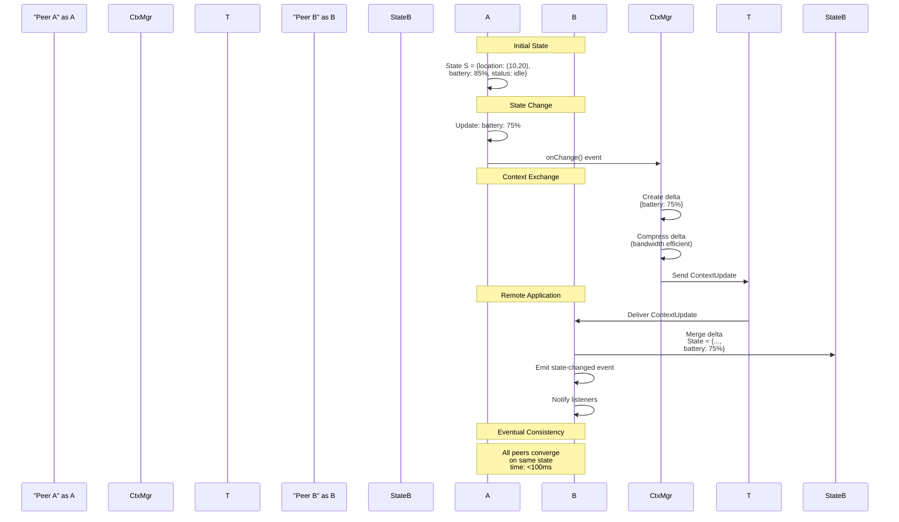

## Discovery and Registration State Machine

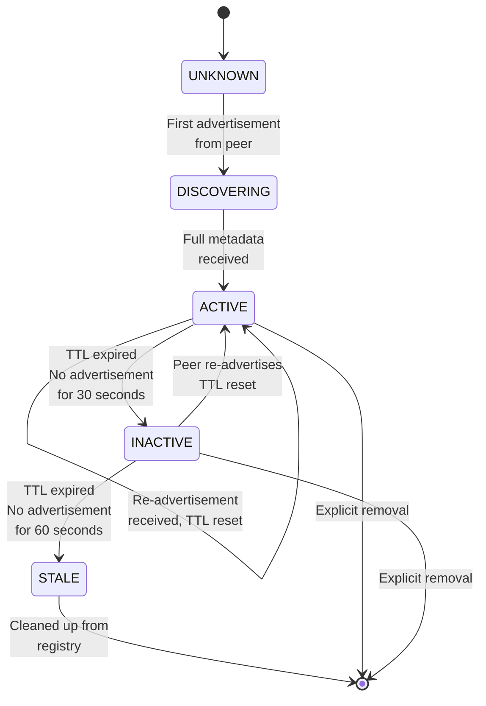

## Trust State Machine

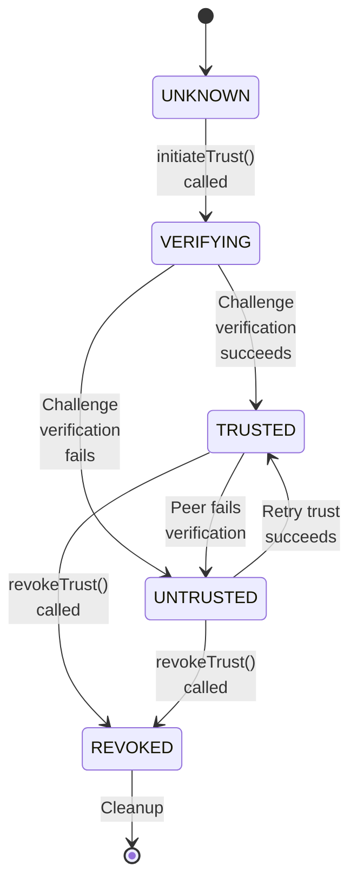

## Multi-Transport Architecture (Phase 7 Vision)

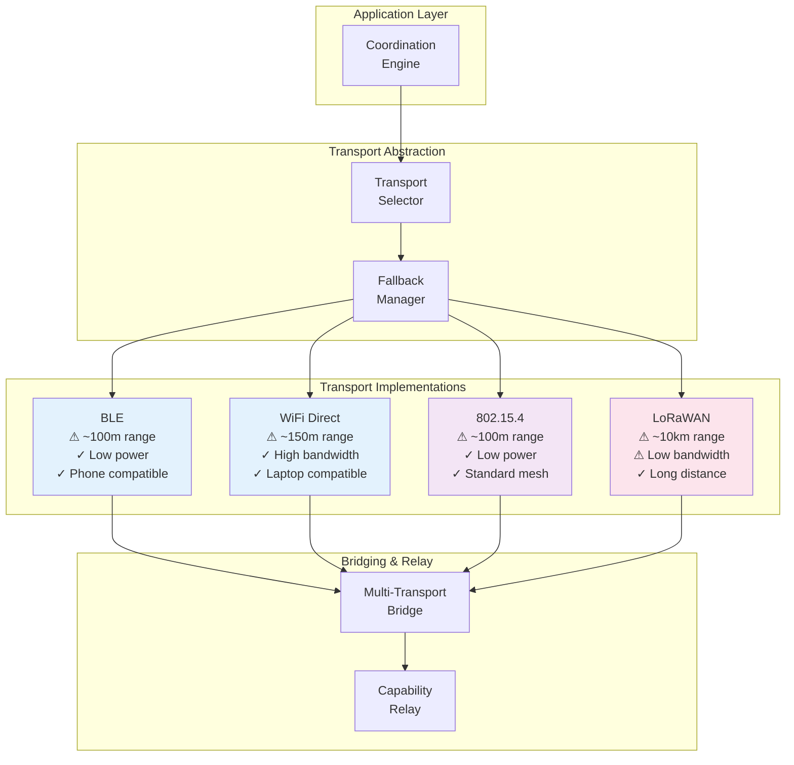

## Performance Characteristics Timeline

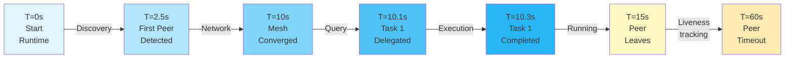

## Message Flow for Multi-Hop Task (Phase 4+)

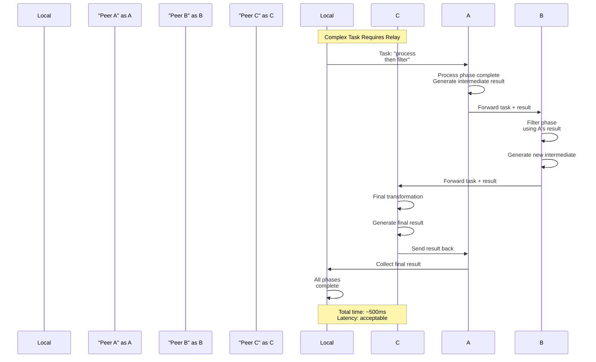

---

## Rendering Notes

These Mermaid diagrams are designed to render in:
- GitHub markdown
- GitLab markdown
- Notion
- Any Mermaid-compatible viewer

For local development, use [mermaid.live](https://mermaid.live) to view and edit.

---

**Last Updated**: June 2026 | **Version**: 0.1.0-alpha
